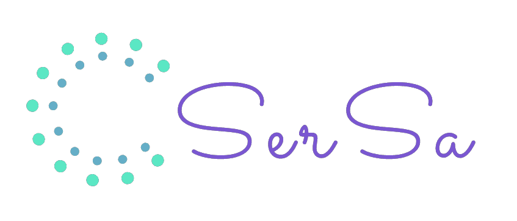

# Surf-Shop

## Dependencies

### Install dependencies

> npm install

#### Running project on development

#### Open your Terminal/Shell and type:

> nodemon

After the command your application should start right in your default browser at localhost:3000